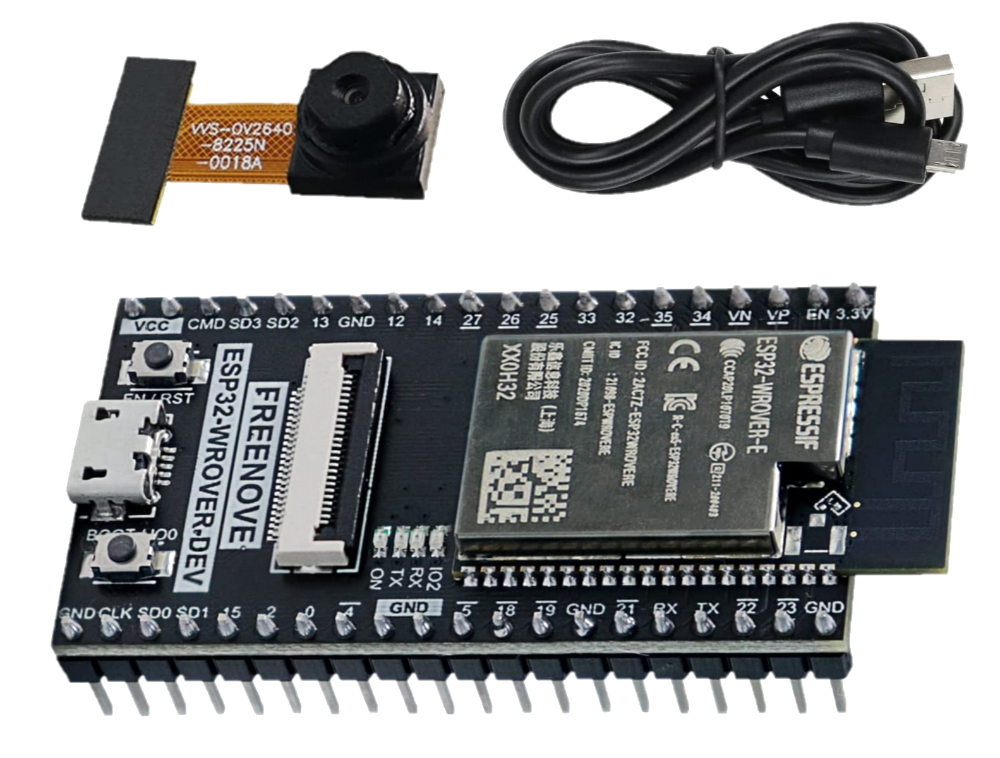

# LavaLampEncryption

This repository contains a project for the course Embedded Software for the Internet of Things @Unitn.

The project consists in a system that generate seeds using a **Lava Lamp** as a source of entropy. These seeds are then used to encrypt and decrypt messages using ( insert algorithm ), generate random numbers and so on.

## Features

> - The system has a **LCD display** that allows the user to:
>   - generate new **seeds**
>   - **generate randoms numbers** in a given range
>   - change **display settings** sush as: animations and color theme  
> - The system implements a **Telegram bot** the allows the user to:
>   - generate *random numbers*
>   - **encrypt** and **decrypt messages**


## Hardware requirements

- ESP32-Wrover-Cam

<div align="center">
    
</div>

- MSP432P401R

<div align="center">
    
</div>

- MSP432P401R BoosterPack

<div align="center">
    
</div>

- Lava Lamp


# Structure

```
.
├── ESP32-Wrover-Cam
│   ├── include
│   │   └── README
│   ├── platformio.ini
│   ├── src
│   │   ├── config.h
│   │   ├── main.cpp
│   │   ├── telegram.cpp
│   │   └── telegram.h
│   └── test
│       └── README
└── MSP432
    ├── Debug
    │   └── ...
    ├── LcdDriver
    │   └── ...
    ├── libs
    │   └── ...
    ├── msp432p401r.cmd
    ├── src
    │   └── main.c
    ├── startup_msp432p401r_ccs.c
    ├── system_msp432p401r.c
    └── targetConfigs
        └── ...
```

The ``` ESP32-Wrover-Cam ``` folder contains the code for the ESP32. The code is written in C++ and it uses the Arduino framework. The code is structured in the following way:

- ``` include ``` contains the header files
- ``` lib ``` contains the libraries used by the project
- ``` src ``` contains the source files
- ``` test ``` contains the test files

The ``` MSP432 ``` folder contains the code for the MSP432. The code is written in C and it uses the CCS framework. The code is structured in the following way:

- ``` Debug ``` contains the debug files
- ``` LcdDriver ``` contains the LCD driver files
- ``` libs ``` contains the libraries used by the project
- ``` src ``` contains the source files
- ``` targetConfigs ``` contains the target configuration files

# How to use (Reccomended)

## Prerequisites

:white_check_mark: [Visual Studio Code](https://code.visualstudio.com/)

:white_check_mark: [PlatformIO extension](https://platformio.org/install/ide?install=vscode) / [ArduinoIDE (not tested)](https://www.arduino.cc/en/software)

:white_check_mark: [CCS](http://www.ti.com/tool/CCSTUDIO)

:white_check_mark: [ESP-CAM-driver - CH340](http://www.wch-ic.com/search?q=CH340&t=downloads)

We assume that you have already installed ```Visual Studio Code``` with ``` PlatformIO ``` extension and ```CCS``` with the MSP432P401R support. If you haven't done it yet, please follow the instructions in the links above.

Clone the repository using the following command:

```bash
git clone https://github.com/luiss07/LavaLampEncryption.git
```

## MSP432

1. Open the ``` MSP432 ``` folder in CCS
2. Include the following libraries in the project:
    - ``` LcdDriver ```( already included in the repository )
    - ``` driverLib ``` :arrow_right: [Download](https://drive.google.com/file/d/1krZfBNAFiE6yAChQfHZVE-b0wfuDitgV/view) :arrow_right: follow the [DriverLibInstruction](./MSP432/driverLibInstruction.md) to install the library.

3. Build and upload the code

## ESP32-Wrover-Cam

1. Open the ``` ESP32-Wrover-Cam ``` folder in Visual Studio Code
2. Create the ``` src/secrets.h ``` file and set the following parameters:

``` c++
#ifndef __SECRETS_H__
#define __SECRETS_H__
#define WIFI_SSID "your_wifi_ssid"
#define WIFI_PASSWORD "your_wifi_password"
#define TOKEN "your_telegram_bot_token"
#endif
```

3. Connect the ESP32 to your computer
4. Build and upload the code

# Links

- Youtube video to see the project in action: []()

- Presentation: []()

- Telegram bot: [https://t.me/LavaLampEncryptionBot](https://t.me/LavaLampEncryptionBot)

# Authors

- [Luigi Dell'Eva](https://github.com/luiss07/)

    - Worked on the ESP32 code to capture the Lava Lamp's photo.
    - Serial communication between the ESP32 and the MSP432.

- [Riccardo Germenia](https://github.com/Odinmylord)

    - Wroked on the Telegram bot hosted on the ESP32.
    - Encrypted and decrypted messages using the seeds generated by the ESP32.

- [Luca Cavalcanti](https://github.com/LucaCavalcanti)

    - Worked on the MSP432 code of the LCD display.