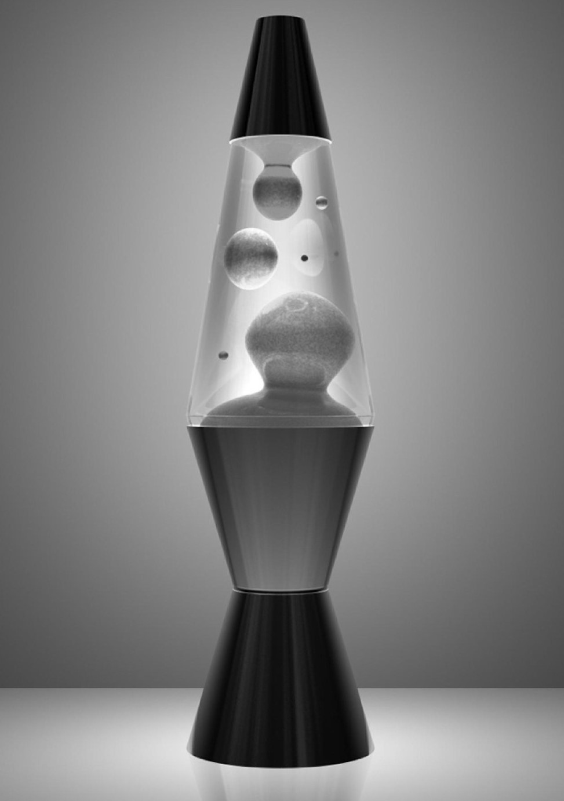

# LavaLampEncryption

This repository contains a project for the course Embedded Software for the Internet of Things @Unitn.

The project consists in a system that generate seeds using a **Lava Lamp** as a source of entropy. These seeds are then used to encrypt and decrypt messages using **AES** (Advanced Encryption Standard), generate random numbers and so on.

## Features

> - The system has a **LCD display** that allows the user to:
>   - generate new **seeds**
>   - **generate randoms numbers** in a given range
>   - change **display settings** sush as: animations and color theme  
> - The system implements a **Telegram bot** the allows the user to:
>   - generate *random numbers*
>   - **encrypt** and **decrypt messages**


## Hardware requirements

- **ESP32-Wrover-Cam**

<div align="center">
    
</div>

- **MSP432P401R**

<div align="center">
    
</div>

- **MSP432P401R BoosterPack**

<div align="center">
    
</div>

- **Lava Lamp**

<div align="center">
    
</div>


# Structure

```
.
├── ESP32-Wrover-Cam
│   ├── include
│   │   └── ...
│   ├── platformio.ini
│   └── src
│       ├── main.cpp
│       └── ...
├── MSP432
│   ├── Debug
│   │   └── ...
│   ├── LcdDriver
│   │   └── ...
│   ├── driverLibInstruction.md
│   ├── libs
│   │   ├── LavaLampInterface
│   │   │   └── ...
│   │   ├── LavaLampInterruptsAndSetup
│   │   │   └── ...
│   │   └── shared.h
│   ├── msp432p401r.cmd
│   ├── src
│   │   └── main.c
│   ├── startup_msp432p401r_ccs.c
│   ├── system_msp432p401r.c
│   └── targetConfigs
│       └── ...
├── README.md
└── images
    └── ...
```

The ``` ESP32-Wrover-Cam ``` folder contains the code for the ESP32. The code is written in C++ and it uses the Arduino framework. The code is structured in the following way:

- ``` include ``` contains the header files
- ``` src ``` contains the source files

The ``` MSP432 ``` folder contains the code for the MSP432. The code is written in C and it uses the CCS framework. The code is structured in the following way:

- ``` Debug ``` contains the debug files
- ``` LcdDriver ``` contains the LCD driver files
- ``` libs ``` contains the libraries created by us used for the project
- ``` src ``` contains the source files
- ``` targetConfigs ``` contains the target configuration files

# Getting Started

## Prerequisites

:white_check_mark: [Visual Studio Code](https://code.visualstudio.com/)

:white_check_mark: [PlatformIO extension](https://platformio.org/install/ide?install=vscode) / [ArduinoIDE (not tested)](https://www.arduino.cc/en/software)

:white_check_mark: [CCS](http://www.ti.com/tool/CCSTUDIO)

:white_check_mark: [ESP-CAM-driver - CH340](http://www.wch-ic.com/search?q=CH340&t=downloads)

## Installation

We assume that you have already installed ```Visual Studio Code``` with ``` PlatformIO ``` extension and ```CCS``` with the MSP432P401R support. If you haven't done it yet, please follow the instructions in the links above.

Clone the repository using the following command:

```bash
git clone https://github.com/luiss07/LavaLampEncryption.git
```

### MSP432

1. Open the ``` MSP432 ``` folder in CCS
2. Include the following libraries in the project:
    - ``` LcdDriver ```( already included in the repository )
    - ``` driverLib ``` :arrow_right: [Download](https://drive.google.com/file/d/1krZfBNAFiE6yAChQfHZVE-b0wfuDitgV/view) :arrow_right: follow the [DriverLibInstruction](./MSP432/driverLibInstruction.md) to install the library.

3. Build and upload the code

### ESP32-Wrover-Cam

1. Open the ``` ESP32-Wrover-Cam ``` folder in Visual Studio Code
2. Create the ``` include/secrets.h ``` file and set the following parameters:

``` c++
#ifndef __SECRETS_H__
#define __SECRETS_H__
#define WIFI_SSID "your_wifi_ssid"
#define WIFI_PASSWORD "your_wifi_password"
#define TOKEN "your_telegram_bot_token"
#endif
```

3. Connect the ESP32 to your computer
4. Build and upload the code

### Setting up serial communication

1. Connect the ESP32 to the MSP432 using the following pins:

|  ESP32  |   MSP432   |
|---------|------------|
| P3.3 TX | GPIO_14 RX |
| P3.2 RX | GPIO_12 TX |


# Links

<a href="https://www.youtube.com/watch?v=YDSb96TMZ5s" target="_blank" rel="noopener noreferrer">
 
</a>

<a href="https://docs.google.com/presentation/d/1XDFrpeXNDiwigWuISPk0ZUGl-KXEEctLxwIQ9cQbYdg/edit?usp=sharing" target="_blank" rel="noopener noreferrer">
 
</a>

<a href="https://t.me/LavaLampEncryptionBot" target="_blank" rel="noopener noreferrer">
 
</a>

# Authors

<a href="https://github.com/luiss07/" target="_blank" rel="noopener noreferrer">
 
</a>

    - Worked on the ESP32 code to capture the Lava Lamp's photo.
    - Serial communication between the ESP32 and the MSP432.

<a href="https://github.com/Odinmylord" target="_blank" rel="noopener noreferrer">
 
</a>

    - Worked on the Telegram bot hosted on the ESP32.
    - Encrypted and decrypted messages using the seeds generated by the ESP32.

<a href="https://github.com/LucaCavalcanti" target="_blank" rel="noopener noreferrer">
 
</a>

    - Worked on the MSP432 code of the LCD display.
